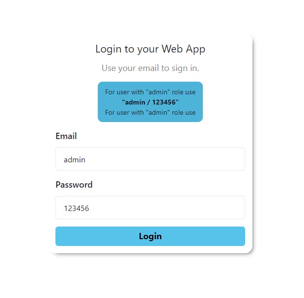

<div  align="center">
  

  <h1>React Test Task</h1>

  <h4>
      <span> · </span>
      <a href="https://react-test-task-a7vw1oh4j-artbal95.vercel.app/">View Demo</a>
      <span> · </span>
  </h4>
</div>

- [About the Project](#1-about-the-project)
    * [Screenshots](#11-screenshots)
    * [Tech Stack](#12-tech-stack)
    * [Color Reference](#13-color-reference)
- [Running Project](#2-running-project)
    * [Clone The Project](#21-clone-the-project)
    * [Go To The Project Directory](#22-go-to-the-project-directory)
    * [Prerequisites](#23-prerequisites)
    * [Install Dependencies With Yarn](#24-install-dependencies-with-yarn)
    * [Start The Server](#25-start-the-server)

## 1: About the Project
  <p>
    Lorem ipsum dolor sit amet, consectetur adipisicing elit. 
    Assumenda blanditiis, commodi enim laborum officiis repellat?
  </p>

### 1.1: Screenshots

<div align="center"> 
  
  
  
  
</div>

### 1.2: Tech Stack

<details>
  <summary>Client</summary>
  <ul>
    <li><a href="https://www.typescriptlang.org/">Typescript</a></li>
    <li><a href="https://reactjs.org/">React.js</a></li>
    <li><a href="https://chakra-ui.com/">Chakra UI</a></li>
  </ul>
</details>

### 1.3: Color Reference

| Color                      | Hex                                                                      |
|----------------------------|--------------------------------------------------------------------------|
| Text Color                 |  #5a5d76  |
| Background Primary Color   |  #E2E8F0  |
| Background Secondary Color |  #0BC5EA |

## 2: Running Project

### 2.1: Clone the project

```bash
  git clone https://github.com/Artbal95/react-test-task.git
```

### 2.2: Go to the project directory

```bash
  cd react-test-task
```

### 2.3: Prerequisites

This project uses Yarn as package manager

Sure that you have yarn

```bash
  ## -> Run
  yarn -v
  ## -> 1.22.17
```

If You Don't Have, Install

```bash
 npm install --global yarn
```

### 2.4: Install Dependencies with yarn

```bash
  yarn install
```

### 2.5: Start the server

```bash
  yarn start
```